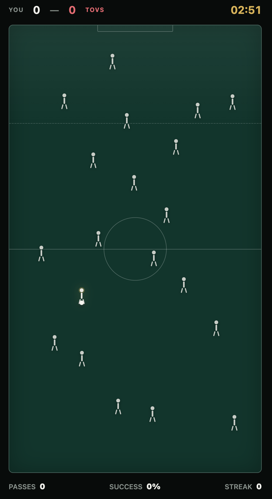

# ⚽ The Game Name is Pass 

### *The 60-Second Tactical Obsession.* 

  

**Remember Google Chrome's Dino Game?** *PASS.* is built for that exact itch. 

No 50GB downloads. No 20-minute tutorials. No login required. Just open `index.html` and test your tactical instinct in quick, high-stakes micro-sessions whenever you need a mental break.

[**PLAY NOW**](#-quick-start) • [**HOW TO PLAY**](#-how-to-play) • [**FEATURES**](#-key-features)

---

## ⚡ What is PASS.?

**PASS.** is a zero-dependency, ultra-minimalist football strategy game designed for instant, high-speed tactical decision-making. 

Everyone on the pitch looks identical. Your squad is scattered among the opposition in a sea of monochrome silhouettes. Your goal? Spot your teammates, map out safe passing lanes, avoid offsides, and execute rapid forward combination play to score—all under intense time pressure.

It takes **5 seconds to learn** and **hours to master**.

---

## 🎮 Key Features

- ⚡ **Zero Load Time:** Single vanilla HTML file (~15KB). Runs natively in any web browser on desktop or mobile.
- 🎯 **Tactical Blind Test:** Players on both teams share identical visual silhouettes. Success relies entirely on memory, spatial awareness, and quick reactions.
- 📐 **Dynamic Offside Engine:** Real-time offside line detection calculated on every forward pass.
- 🔊 **Procedural Web Audio:** Custom sound effects synthesized in real-time via the Web Audio API—no external audio files required.
- ⏱️ **Custom Match Modes:** Play against a 1/3/5-minute clock or race to score 3, 5, or 10 goals with minimal turnovers.
- 📱 **Mobile Ready:** Touch-optimized UI designed for smooth single-thumb play on phones.

---

## ⚽ How to Play

1. **Find Possession:** You start with the ball at the feet of your highlighted playmaker.
2. **Identify Teammates:** Memorize which player is yours when the pitch generates!
3. **Tap to Pass:** Tap any player on the pitch to pass the ball.
4. **Avoid Interceptions:** Passing to an opponent results in an immediate **Turnover**.
5. **Watch the Offside Line:** Don't pass to a teammate positioned beyond the last defender unless you are moving backward.
6. **Score:** Work the ball into the top goal zone to score a **GOAL!**

---

## 🚀 Quick Start

No package managers, build steps, or server setups required.
